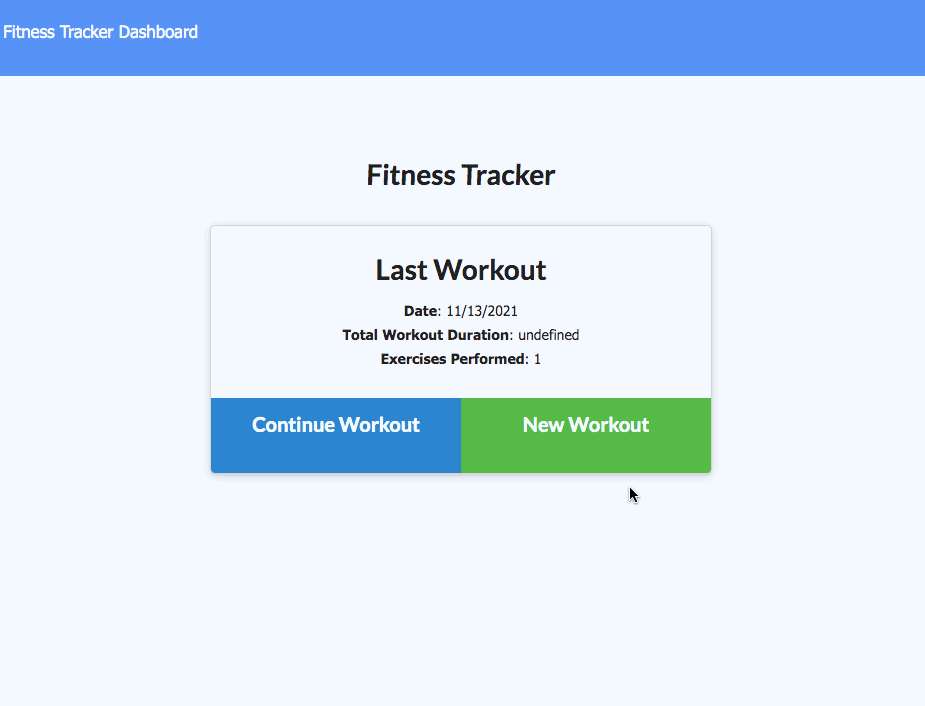

# [Fitness Tracker](https://afternoon-journey-09370.herokuapp.com/stats)

This is an app which allows users to add a workout to the database, then add exercises to that workout. If the user has a latest workout, they will be able to see information about it on the landing page. Otherwise, they will be prompted to create a new workout. On the dashboard, users can view four different charts and graphs displaying information regarding their workouts, as well as their workout completions.

## Built With

- [NodeJS](https://nodejs.org/)
- [Express](https://expressjs.com/)
- [MongoDB](https://www.mongodb.com/)
- [Mongoose](https://mongoosejs.com/)
- [Javascript](https://developer.mozilla.org/en-US/docs/Web/JavaScript)
- [CSS](https://developer.mozilla.org/en-US/docs/Web/CSS)
- [HTML](https://developer.mozilla.org/en-US/docs/Web/HTML)

## Live deployed link

- [Check out the site here](https://afternoon-journey-09370.herokuapp.com/stats)

## Created by

**Matt Stephens**

- [Link to Portfolio Site](https://mstephen19.github.io/my-portfolio)
- [Link to Github](https://github.com/mstephen19)
- [Link to LinkedIn](https://www.linkedin.com/mstephen19)

### Acknowledgments

- Shoutout to [Jesse Lewis](https://www.linkedin.com/in/jesseaustinlewis/) for being SO right about MongoDB being better than MySQL
